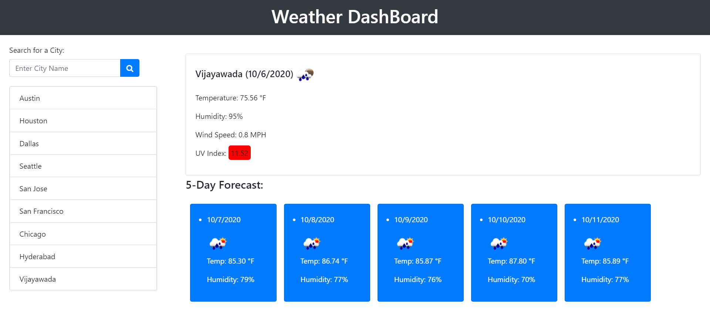

# Weather Dashboard

# Application Does:
* This applcation shows the weather details of the city and gives 5 days weather forecast.

# Technologies used:
* HTML, CSS, JavaScript, JQuery

# Features:
  When search for a city presented with:
 * City Name , Date
 * city current temperature,
 * humidity,
 * uv index, 
 * climate indication icon
 * 5 Days Forecast
 * Add to search History
 * Colors added to UV Index indicates climate condition (favorable , moderate , severe)
 * Saves last searched city forecast

# Challenges:
* Getting climate condition using different API's
* Fetching icons and UV index colors

# Sample web page

# Github Page 
  https://vsatyakavya.github.io/WeatherDashBoard.github.io/Develop

# Github Repository
https://github.com/vsatyakavya/WeatherDashBoard.github.io

# Contact
satyakavya24@gmail.com 

@copyright 2020
